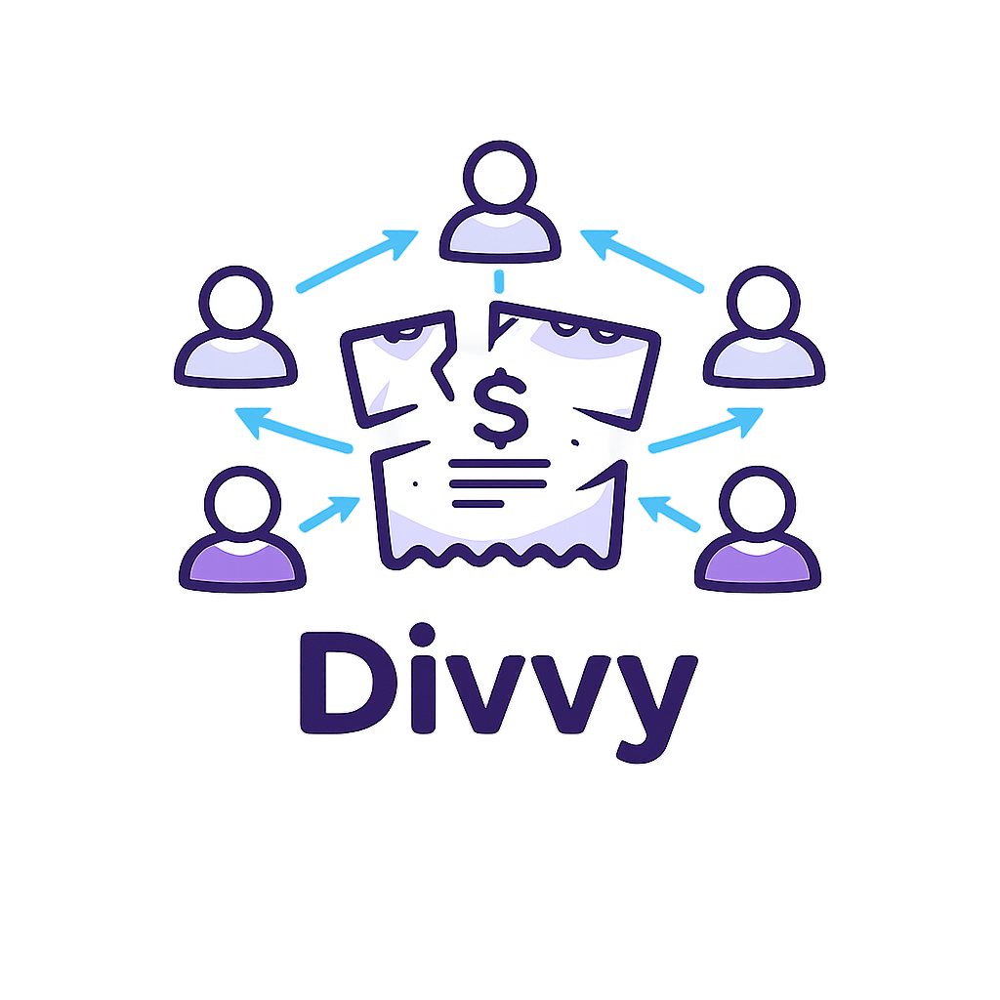
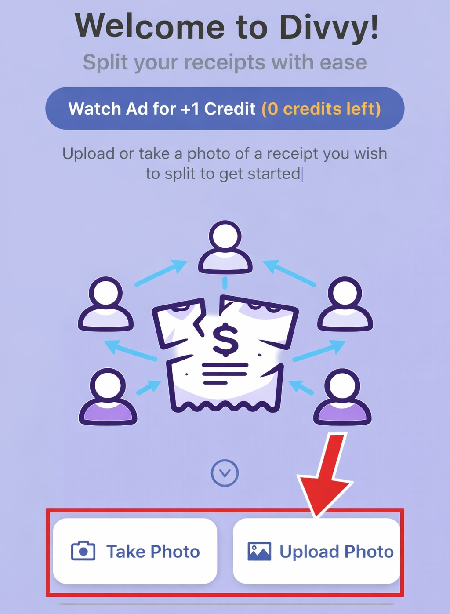
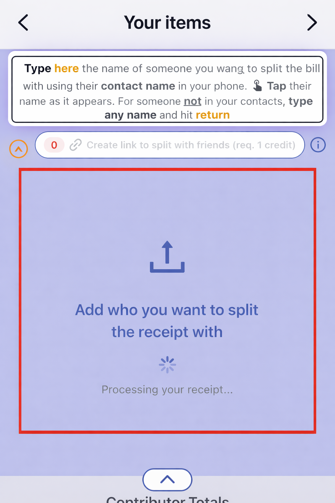
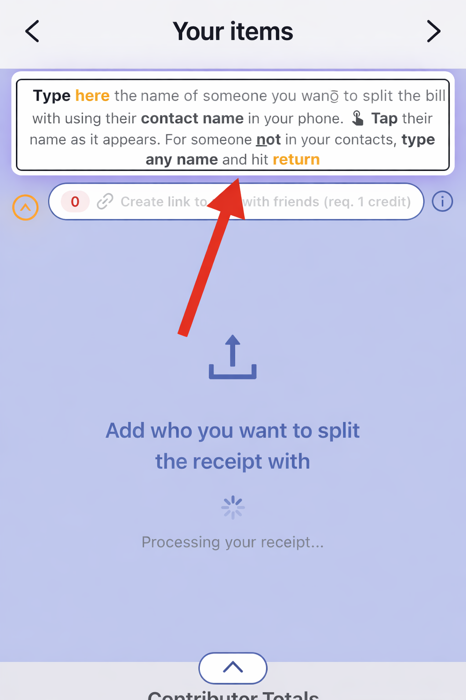
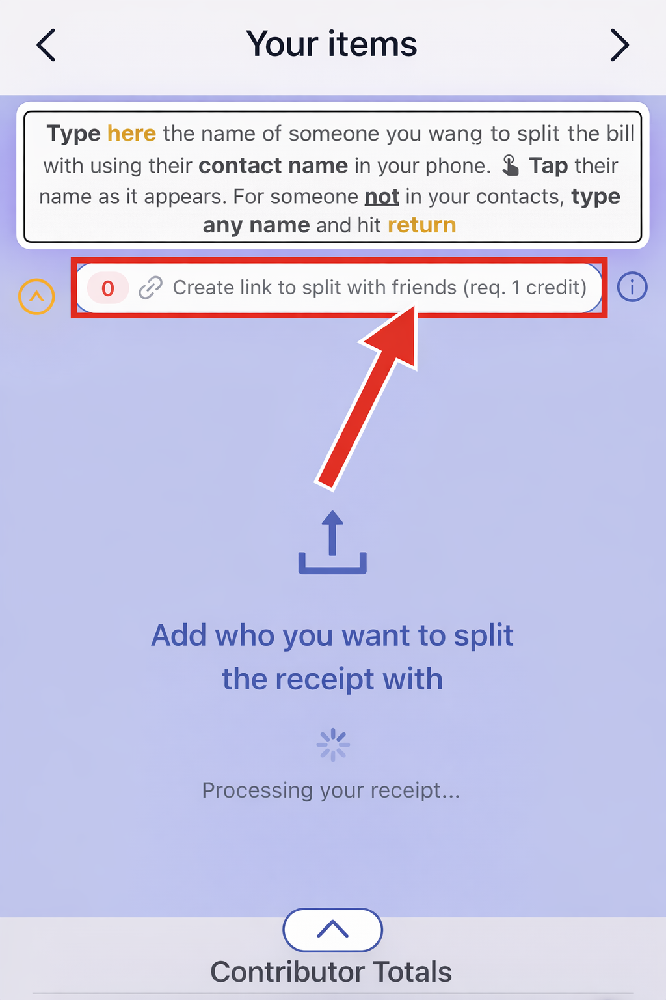
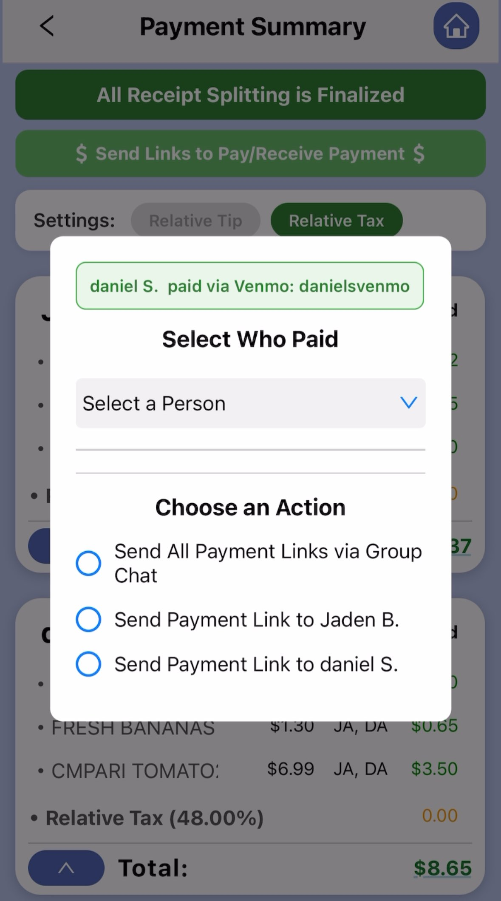
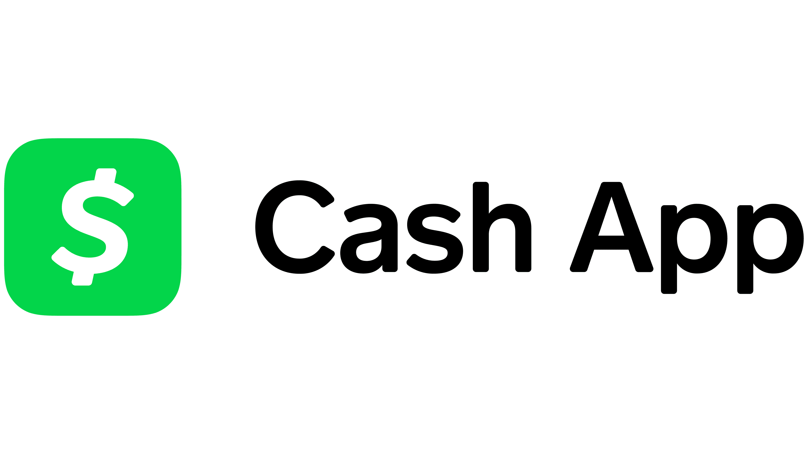

# Divvy - The Easy Bill Splitter

<p align="center">
  
</p>

Snap a photo of any receipt. AI reads every item, price, and total. Assign items to friends, generate a shareable web link, and get paid back through Venmo, PayPal, or Cash App. No app needed on their end.

### App Screenshots

<p align="center">
  
  &nbsp;&nbsp;
  
  &nbsp;&nbsp;
  
  &nbsp;&nbsp;
  
  &nbsp;&nbsp;
  
</p>

### Accepted Payment Methods

<p align="center">
  
  &nbsp;&nbsp;&nbsp;&nbsp;
  
  &nbsp;&nbsp;&nbsp;&nbsp;
  
</p>

---

## How It Works

1. **Scan** — Take a photo of any receipt and AI extracts every item, price, tax, and total instantly
2. **Split** — Add friends and tap items to assign who ordered what. Tax and tip are split proportionally
3. **Share** — Generate a web link your friends can open in any browser — no app install needed
4. **Pay** — One-tap payment links via Venmo, PayPal, or Cash App with itemized breakdowns

---

## Features

- **AI Receipt Scanning** — Handles handwritten receipts, itemized bills, tax, discounts, and tips
- **Smart Splitting** — Assign items to multiple people. Tax and tip split proportionally based on what each person ordered
- **Shareable Web Links** — Recipients open a link in their browser to see their share and pay. No app download required
- **Payment Deep Links** — Venmo, PayPal, and Cash App links pre-filled with the exact amount and itemized notes
- **Receipt History** — Track past splits, see who's paid, and revisit any receipt
- **Free to Use** — Watch a short ad to earn a scan credit. No subscriptions, no paywalls. First scan is free

---

## App Flow

```
Start Screen --> Tutorial --> Login --> Home
                                         |
                             +-----------+-----------+
                             |           |           |
                        Watch Ad    Upload/Camera   History
                             |           |           |
                       Ad Cascade    AI Scanning    Past Receipts
                       (4 tiers)   (uses 1 credit)  (paid tracking)
                             |           |
                        Earn Credit   Split Items
                                     - Add friends
                                     - Assign items
                                     - Create share link
                                          |
                                      Breakdown
                                      - Payment summary
                                      - Select who paid
                                      - Send payment links
```

---

## Apple Review Journey

This app went through multiple rounds of Apple App Store review. Each rejection led to significant improvements:

| Review | Date | Result | Key Issue | Fix |
|--------|------|--------|-----------|-----|
| #1 | Apr 7, 2026 | Rejected | Privacy strings too vague + iPad unresponsive | Rewrote purpose strings with specific examples, disabled iPad |
| #2 | Apr 10, 2026 | Rejected | No ads loaded in review sandbox | Built 4-tier ad cascade with free pass fallback |
| #3 | Apr 2026 | Pending | — | Full cascade + progressive status + review notes |

See [docs/apple-reviews/](docs/apple-reviews/) for the full review history with responses.

---

## Revenue Model

Users watch a rewarded ad to earn 1 scan credit. Each receipt scan consumes 1 credit. New users get 1 free credit on signup. A 4-tier ad cascade (rewarded video, rewarded interstitial, interstitial, free pass) ensures users are never stuck — if no ads are available, a daily free pass grants a credit automatically.

---

## Status

**Version:** 1.0.0 | **Platform:** iOS (iPhone) | **Status:** In App Store Review

---

## Links

- **Website:** [divvy-app-491221.web.app](https://divvy-app-491221.web.app)
- **Privacy Policy:** [divvy-app-491221.web.app/privacy-policy.html](https://divvy-app-491221.web.app/privacy-policy.html)

---

## Repository Structure

```
Divvy/
├── README.md                  # This file
├── CHANGES.md                 # High-level changelog
├── LICENSE                    # All rights reserved
├── docs/
│   └── apple-reviews/         # Apple review history with responses
├── website/
│   ├── index.html             # Landing page
│   ├── privacy-policy.html    # Privacy policy
│   └── logov2.png             # Logo
└── assets/
    ├── applogo.png            # App icon
    ├── logov2.png             # In-app logo
    ├── tutorial_1-5.png       # App tutorial screenshots
    ├── Venmo_Logo.png         # Venmo logo
    ├── PayPal.png             # PayPal logo
    └── Cash-App-Logo.png      # Cash App logo
```

> **Note:** Source code is maintained in a private repository. This public repo contains documentation, assets, and the Apple review journey for portfolio purposes. Code is available for live demo upon request.

---

## Contact

**Jaden Brescia** — jadenbresciawebsite@gmail.com

---

Copyright (c) 2026 Jaden Brescia. All rights reserved.
