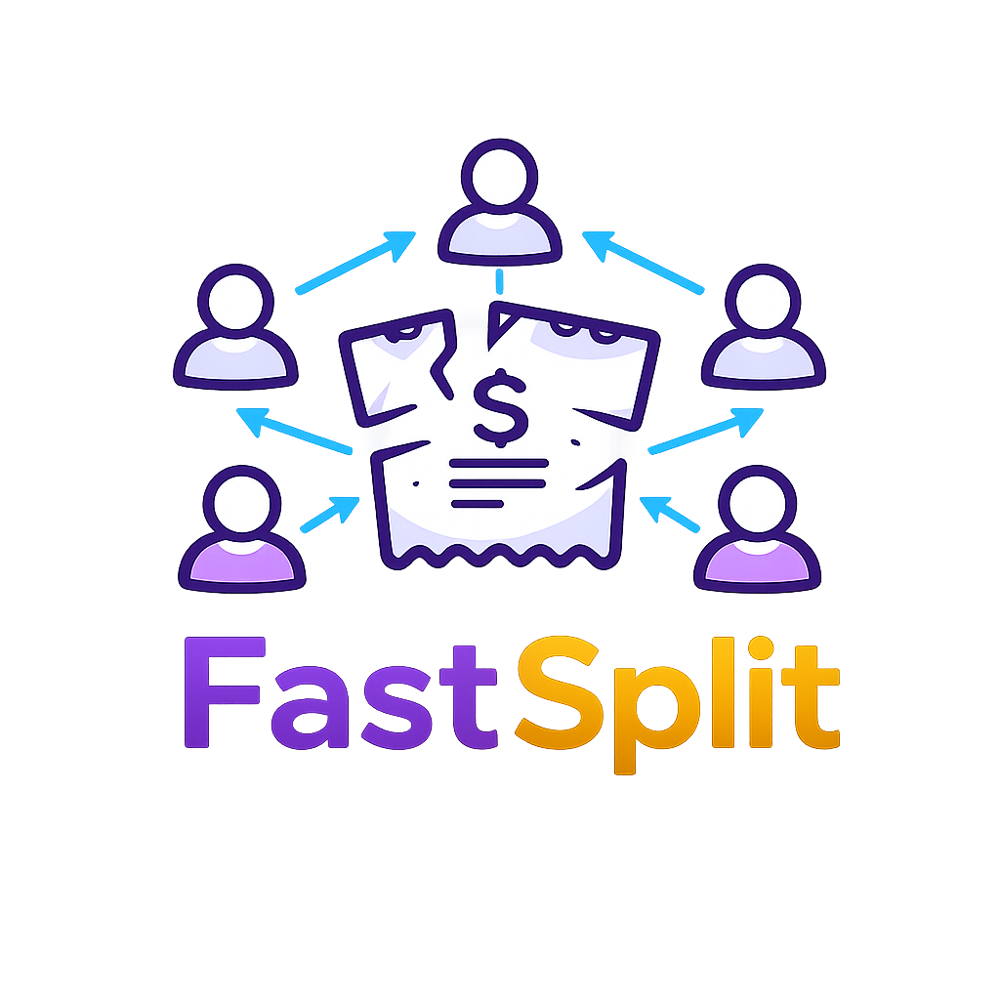
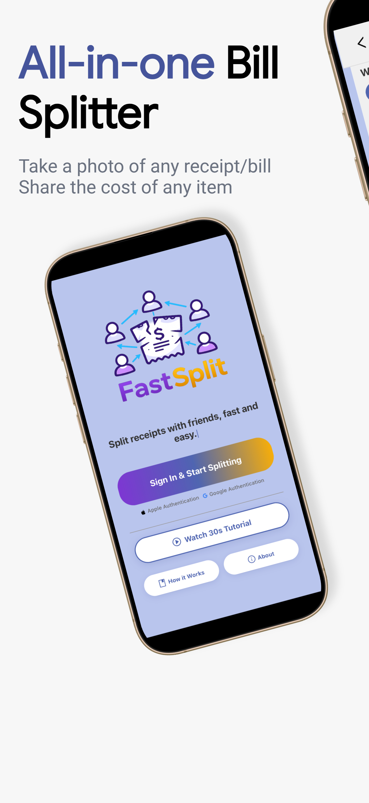
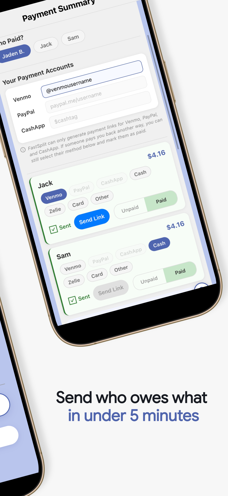
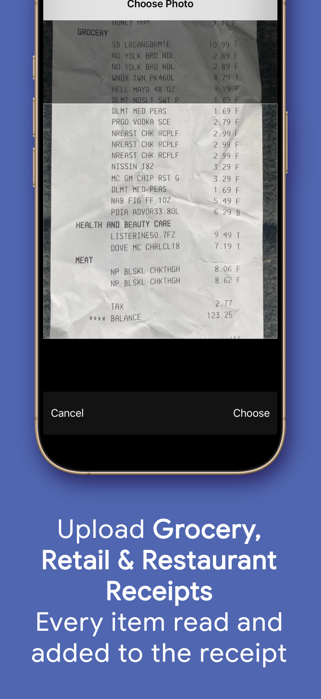
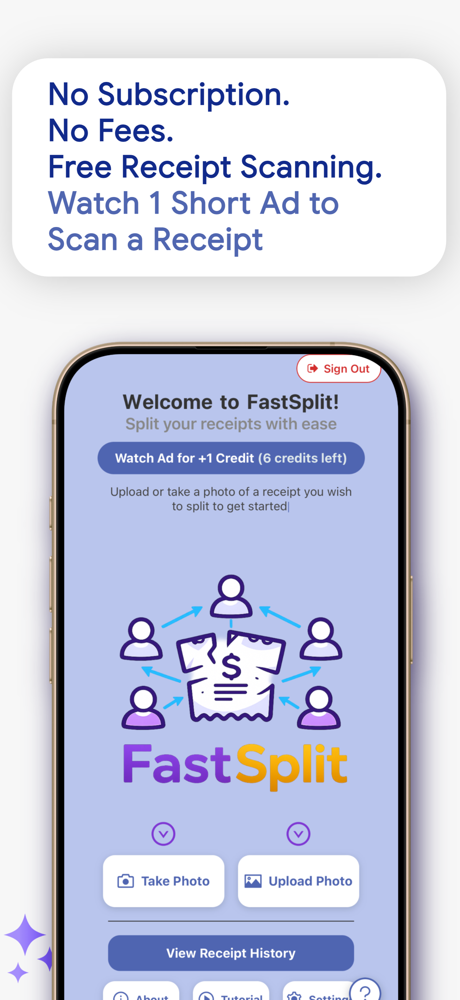
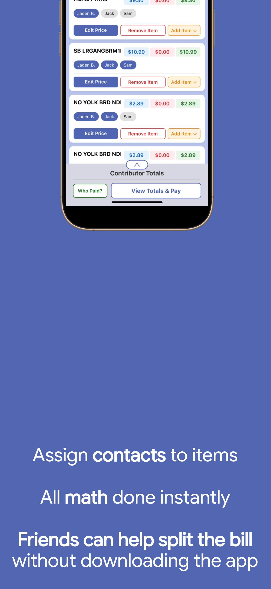

# FastSplit - The Easy Bill Splitter

<p align="center">
  
</p>

Snap a photo of any receipt. AI reads every item, price, quantity, and total. Assign items to friends, generate a shareable web link, and get paid back through Venmo, PayPal, or Cash App. No app needed on their end.

**Live on the iOS App Store:** [apps.apple.com/us/app/fastsplit/id6761271231](https://apps.apple.com/us/app/fastsplit/id6761271231)

### App Video

▶ **[Watch the FastSplit tutorial video](assets/FastSplit_Tutorial.mp4)** — the full in-app walkthrough: scan → split → share → pay.

### App Screenshots

<p align="center">
  
  &nbsp;&nbsp;
  
  &nbsp;&nbsp;
  
  &nbsp;&nbsp;
  
  &nbsp;&nbsp;
  
</p>

### Accepted Payment Methods

<p align="center">
  
  &nbsp;&nbsp;&nbsp;&nbsp;
  
  &nbsp;&nbsp;&nbsp;&nbsp;
  
</p>

---

## How It Works

1. **Scan** — Take a photo of any receipt and AI extracts every item, price, quantity, tax, and total instantly
2. **Split** — Add friends and tap items to assign who ordered what. Tax and tip are split proportionally
3. **Share** — Send friends a link they can open in any browser to mark their own items — no app install needed
4. **Pay** — One-tap payment links via Venmo, PayPal, or Cash App with itemized breakdowns

---

## Features

- **AI Receipt Scanning** — Handles itemized bills, quantities, tax, discounts, and tips across restaurant, grocery, and retail receipt formats
- **Quantity Splitting** — A "3 x Juice" line shows as ×3 with a **Split Item** button that breaks it into single rows (penny-exact math) so each one can go to a different person — with Undo
- **Accuracy Safeguards** — Items the AI wasn't sure about are highlighted for review, and a built-in totals check compares the parsed math line-by-line against your receipt photo so mistakes are easy to spot and fix
- **Smart Splitting** — Assign items to multiple people; tax and tip split proportionally (or fixed) based on what each person ordered
- **Shareable Web Links** — Friends open a link in their browser, mark their own items, and pay. No app download required
- **Confirm & Lock** — Finalize a split to freeze editing on both the app and the shared link so totals can't change after everyone agrees (fully reversible)
- **Payment Deep Links** — Venmo, PayPal, and Cash App links pre-filled with the exact amount; Cash, Zelle, and card users get a plain amount-owed message
- **Payment Tracking** — A step-by-step post-split flow: who paid → how they get paid back → per-person send + paid/unpaid tracking
- **Receipt History** — Revisit past splits, rename receipts, and track who's paid
- **Free to Use** — Watch a short ad to earn a scan credit. No subscriptions, no paywalls. First scan is free, with a free daily pass when no ads are available
- **Reliability Engineering** — Idempotent uploads (SHA-256 dedup), undo for deletes and splits, launch-time update gate, remote maintenance mode, and Crashlytics monitoring

---

## App Flow

```
Start Screen --> Tutorial --> Login --> Home
                                         |
                             +-----------+-----------+
                             |           |           |
                        Watch Ad    Upload/Camera   History
                             |           |           |
                       Ad Cascade    AI Scanning    Past Receipts
                       (4 tiers)   (uses 1 credit)  (paid tracking)
                             |           |
                        Earn Credit   Split Items
                                     - Add friends
                                     - Assign items (quantities, flags)
                                     - Create share link
                                          |
                                      Breakdown
                                      - Payment summary
                                      - Select who paid
                                      - Send payment links
```

---

## Apple Review Journey

FastSplit (originally launched as Divvy) went through **8 Apple review rejections** before its first approval on May 27, 2026. Each rejection surfaced a new issue — some obvious in hindsight, others surprising. Every one made the app better. Since then, three further versions have been approved.

| # | Date | Guideline | Rejection Reason | Fix |
|---|------|-----------|------------------|-----|
| 1 | Apr 7 | 5.1.1(ii), 2.1(a) | Privacy purpose strings too vague; app froze on iPad after login | Rewrote camera/photo permission strings with specific examples; set `supportsTablet: false` |
| 2 | Apr 10 | 2.1(a) | "No ads displayed" after tapping Watch Ad | Ad networks don't serve in Apple's sandbox — built entire 4-tier ad cascade with free pass fallback |
| 3 | Apr 21 | 2.1(a) | "Screen loads indefinitely" (ad cascade took ~96 seconds) | Cut cascade from 96s to 34s, added visible countdown timer, created demo account with 100 credits |
| 4 | Apr 23 | 2.1(a), 2.1 | Still flagging "no ads"; ATT prompt not found by reviewer | Explained expected sandbox behavior; moved ATT to first Watch Ad tap; provided screen recording from physical device |
| 5 | Apr 23 | 5.1.1(iv) | ATT pre-prompt wording "encouraged tracking" ("Allow Personalized Ads" button) | Complete ATT rewrite — neutral "About Ads" title, single "Continue" button, no persuasive language |
| 6 | Apr 25 | 4 (Design) | Google Sign-In opened Safari; sign-up text clipped on iPad | Replaced `@react-native-google-signin` with `expo-auth-session` (in-app `ASWebAuthenticationSession`); built responsive scaling hook |
| 7 | Apr 28 | 4 (Design) | Google Auth re-raised (was actually ASWebAuthenticationSession); iPad toggle re-raised | Responded with video evidence from physical iPad proving in-app auth; added ScrollView wrapping for iPad |
| 8 | May 25 | 2.1 | ATT prompt not found by reviewer (re-raised) | No code change — responded with video evidence showing ATT flow. **Approved May 27.** |

### Since the first approval

| Version | Result | What shipped |
|---------|--------|--------------|
| Metadata update | Approved | Marketing URL added for AdMob `app-ads.txt` verification |
| v1.8.0 | Approved & released | **Rebrand to FastSplit**, custom domain (fastsplitapp.com), in-app video tutorial, upload idempotency, Firebase Analytics, full iPad support |
| v1.9.0 | Approved & released (Jul 2026) | Redesigned step-by-step payment screen, Confirm/lock edit-freeze (app + share link), receipt names in History, update gate + remote maintenance mode |
| v1.10.0 | Submitting (Jul 2026) | Receipt quantities + Split Item, AI-accuracy safeguards (flagged items + line-by-line totals check against the photo), item-delete undo, ask-first ad dialogs |

### Lessons Learned

**Apple tests on iPad even if you declare iPhone-only.** Setting `supportsTablet: false` removes your app from iPad search results, but Apple reviewers still test iPhone apps in iPad compatibility mode. Layout bugs there will get you rejected.

**Ad networks don't serve ads during App Review.** This caused three consecutive rejections (Reviews 2-4). Google AdMob and Unity Ads return nothing in Apple's sandbox. The solution was a 4-tier ad cascade with a backend free pass system, plus a demo account with pre-loaded credits so reviewers could test without ads.

**ATT pre-prompt wording is heavily scrutinized.** Buttons labeled "Allow Personalized Ads" were flagged as directing users toward accepting tracking. Even a "No Thanks" option that skipped ATT was a violation. Apple requires strictly neutral language — a single "Continue" button that always leads to the system dialog.

**Provide video evidence.** Starting with Review 4, screen recordings from a physical device proved that features (ATT, Google Auth, permissions) were working correctly. Apple can only test what they can see in their environment. Video evidence resolved the final rejection (Review #8) without any code change.

**Persistence pays off.** Reviews #7 and #8 re-raised issues that were already fixed — the reviewer misidentified ASWebAuthenticationSession as Safari, and didn't navigate to the ATT trigger point. Both were resolved by responding with evidence rather than changing code. Sometimes "the fix" is better communication.

**Every rejection made the app better.** The ad system went from a single ad format with no fallback to a production-grade cascade with SSV verification, rate limiting, mediation, and a free pass safety net. The login flow went from opening Safari to a seamless in-app sheet. None of these improvements would have happened without the review process.

See [docs/apple-reviews/](docs/apple-reviews/) for the full review history with detailed responses.

---

## Revenue Model

Users watch a rewarded ad to earn 1 scan credit. Each receipt scan consumes 1 credit. New users get 1 free credit on signup. A 4-tier ad cascade (rewarded video, rewarded interstitial, interstitial, free pass) ensures users are never stuck — if no ads are available, a daily free pass grants a credit automatically.

---

## Status

**Version:** 1.9.0 live · 1.10.0 submitting | **Platform:** iOS (iPhone + iPad) | **Status:** Live on the App Store (first approved May 27, 2026) — actively improving

> FastSplit is **live on the App Store** after 8 rejections and 51 days of review, followed by three approved updates. What started as an MVP is now a production app: rebranded, on a custom domain, with a redesigned payment flow, quantity-aware AI receipt parsing with accuracy safeguards, and shareable web links friends can use without installing anything.

---

## Links

- **App Store:** [apps.apple.com/us/app/fastsplit/id6761271231](https://apps.apple.com/us/app/fastsplit/id6761271231)
- **Website:** [fastsplitapp.com](https://fastsplitapp.com)
- **Privacy Policy:** [fastsplitapp.com/privacy-policy.html](https://fastsplitapp.com/privacy-policy.html)

> **Note:** Source code is maintained in a private repository. This public repo contains documentation, assets, and the Apple review journey for portfolio purposes. Code is available for live demo upon request.

---

## Contact

**Jaden Brescia** — jadenbresciawebsite@gmail.com

---

Copyright (c) 2026 Jaden Brescia. All rights reserved.
